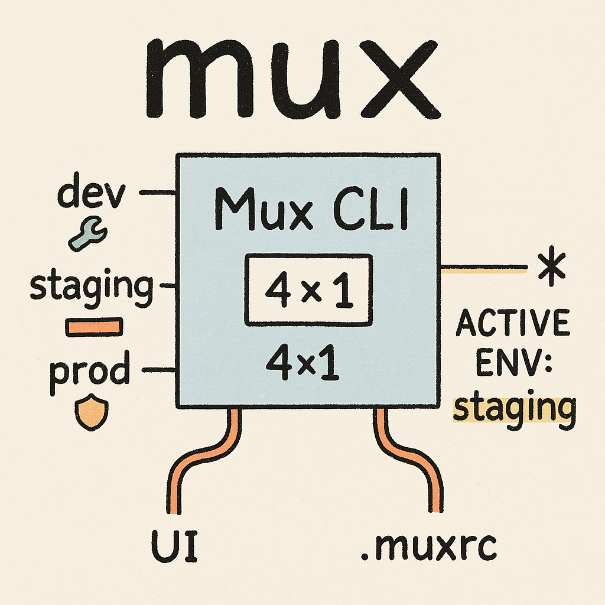

# Mux CLI

<p align="center">
  
</p>

Manage and switch environment profiles across dimensions.

## Description

Mux makes it easy to configure and switch between different environment settings (like Kubeconfigs, cloud credentials, etc.) organized by "dimensions" (e.g., `kubernetes`, `aws`).

## Quick Start

1.  **Install Prerequisites:**
    
    **Install poetry and pipx (dependency management):**
    ```bash
    # macOS
    brew install poetry pipx
    
    # Linux (Debian/Ubuntu)
    curl -sSL https://install.python-poetry.org | python3 -
    pip install pipx
    ```
    
    **Install fzf (fuzzy finder):**
    ```bash
    # macOS
    brew install fzf
    
    # Linux (Debian/Ubuntu)
    sudo apt-get install fzf
    ```

2.  **Installation:**
    ```bash
    # Clone the repository (if you haven't already)
    git clone git@github.com:teddyknox/mux.git
    cd mux

    # Install dependencies using Poetry
    poetry install
    
    # Use pipx to install globally and make the 'mux' command available in your PATH.
    pipx install -e .
    ```

3.  **Initialize Configuration:**
    Create the basic Mux setup in your home directory:
    ```bash
    mux init
    # Or initialize with examples:
    mux init --with-examples
    ```
    This creates the `~/.mux/dims/` directory where you'll define your dimensions and profiles.

4.  **Shell Integration (Essential for `switch`):**
    Commands like `mux switch` work by printing shell commands (`export`, `unset`). To make them affect your current shell, you **must** evaluate their output.

    Add the Mux hook to your shell configuration file (`~/.zshrc`, `~/.bashrc`, `~/.config/fish/config.fish`):

    *   **Zsh:** `eval "$(mux hook zsh)"`
    *   **Bash:** `eval "$(mux hook bash)"`
    *   **Fish:** `mux hook fish | source`

    Restart your shell or source your config file (e.g., `source ~/.zshrc`). This also enables **automatic profile switching** based on `.muxrc` files in your project directories.

5.  **Basic Usage:**
    *   **See current status:** `mux status`
    *   **Select profiles interactively:** `mux switch` (Uses `fzf`. The hook will apply changes on the next prompt/directory change.)
    *   **Select a specific profile:** `mux switch <dimension_path> <profile_name>` (e.g., `mux switch kubernetes dev-cluster`. The hook applies the change.)
    *   **Set the default profile for a dimension:**
        *   `mux set-default <dimension_path> <profile_name>` (Sets the default directly)
        *   `mux set-default` (Select dimension and profile interactively using `fzf`)
        *(This command updates the dimension's `default.txt` file.)*

## Core Concepts

*   **Dimensions:** Categories for your profiles (e.g., `kubernetes`, `aws`, `gcp`). Defined as directories under `~/.mux/dims/`. Dimensions can be nested (e.g., `kubernetes/cluster-a`).
*   **Profiles:** Specific configurations within a dimension (e.g., `dev-cluster`, `prod-account`). Defined by environment variables.
*   **`.muxrc` Files:** Place a `.muxrc` file in a project directory to automatically activate specific dimension profiles when you `cd` into it. Example:
    ```
    # project/.muxrc
    kubernetes=dev-cluster
    aws=work-account
    ```

## Configuration Overview

## Profiles

Profiles are defined inside dimension directories (`~/.mux/dims/<dimension>/`). Mux uses the first method it finds in the order: script > YAML > .env files.

### Method 1: Individual `.env` Files

Simple `.env` files in a `profiles/` subdirectory (e.g., `profiles/dev.env`).
Example directory structure:

```bash
mux $ tree ~/.mux
/Users/edward/.mux
├── defaults
│   └── eth_rpc
└── dims
    └── kubernetes
        ├── default.txt
        └── profiles
            ├── a.env
            ├── b.env
            └── c.env
```

Example .env file `~/.mux/dims/kubernetes/profiles/a.env`:
```dotenv
# Comments are allowed
KUBECONFIG=~/.kube/config-dev
K8S_NAMESPACE=development
K8S_CONTEXT=dev-cluster
```

### Method 2: Single `profiles.yaml` File

A single `profiles.yaml` file listing multiple profiles.
Example `~/.mux/dims/aws/profiles.yaml`:
```yaml
dev:
  AWS_PROFILE: development
  AWS_REGION: us-west-2
  AWS_ACCOUNT_ID: "123456789012"

prod:
  AWS_PROFILE: production
  AWS_REGION: us-east-1
  AWS_ACCOUNT_ID: "987654321098"
```

### Method 3: Executable `profiles.py` Script

An executable `profiles.py` script for dynamic generation (outputs JSON).
Example `~/.mux/dims/blockchain/profiles.py`:
```python
#!/usr/bin/env python3
import json
import os

# Example: Generate profiles dynamically
networks = {
    "mainnet": {
        "RPC_URL": "https://mainnet.infura.io/v3/" + os.environ.get("INFURA_KEY", ""),
        "CHAIN_ID": "1"
    },
    "sepolia": {
        "RPC_URL": "https://sepolia.infura.io/v3/" + os.environ.get("INFURA_KEY", ""),
        "CHAIN_ID": "11155111"
    }
}

# The script MUST output a JSON object to stdout
print(json.dumps(networks))
```
*(Remember to make the script executable: `chmod +x ~/.mux/dims/blockchain/profiles.py`)*

## Default Profiles

Set a default profile for a dimension using `mux set-default <dimension> <profile>` or interactively with `mux set-default`. This creates a `default.txt` file.

*For detailed configuration options and advanced usage, please refer to the project documentation or code comments.*

## Hierarchical Dimensions

Mux supports hierarchical dimensions, allowing you to organize related configuration aspects in parent-child relationships. This is useful for scenarios where one configuration depends on another.

### How Hierarchical Dimensions Work

- Dimensions can have subdimensions, stored in a `dims/` directory within the parent dimension
- When you switch a parent dimension, all its child dimensions are automatically deactivated
- Child dimensions can access their parent's active profile (when using dynamic scripts)
- Subdimensions are referenced using path notation (e.g., `kubernetes/namespace`)

### Example: Kubernetes Contexts and Namespaces

A common use case is managing Kubernetes contexts (clusters) as the parent dimension and namespaces as the child dimension:

```bash
mux $ tree ~/.mux/dims/kubernetes
/Users/edward/.mux/dims/kubernetes
├── default.txt                    # Contains default context: "dev"
├── profiles.yaml                  # Defines context profiles
└── dims/                          # Subdimensions directory
    └── namespace/                 # Namespace subdimension
        ├── default.txt            # Default namespace: "default"
        └── profiles.yaml          # Namespace profiles
```

**Parent dimension (kubernetes contexts):**

`~/.mux/dims/kubernetes/profiles.yaml`:
```yaml
dev:
  KUBECONFIG: ~/.kube/config
  KUBE_CONTEXT: dev-cluster
  
staging:
  KUBECONFIG: ~/.kube/config
  KUBE_CONTEXT: staging-cluster
  
prod:
  KUBECONFIG: ~/.kube/config
  KUBE_CONTEXT: production-cluster
```

**Child dimension (kubernetes namespaces):**

`~/.mux/dims/kubernetes/dims/namespace/profiles.yaml`:
```yaml
default:
  KUBE_NAMESPACE: default
  
app:
  KUBE_NAMESPACE: my-application
  
monitoring:
  KUBE_NAMESPACE: monitoring
```

**Using dynamic scripts with parent context:**

For more advanced use cases, you can create a script that dynamically generates profiles based on the parent dimension's active profile:

`~/.mux/dims/kubernetes/dims/namespace/profiles.py`:
```python
#!/usr/bin/env python3
import json
import sys

# Get parent profile (context) if available
parent_profile = sys.argv[1] if len(sys.argv) > 1 else None

# Base namespaces available in all contexts
namespaces = {
    "default": {"KUBE_NAMESPACE": "default"},
    "kube-system": {"KUBE_NAMESPACE": "kube-system"}
}

# Add context-specific namespaces
if parent_profile == "dev":
    namespaces["dev-app"] = {"KUBE_NAMESPACE": "dev-application"}
elif parent_profile == "staging":
    namespaces["staging-app"] = {"KUBE_NAMESPACE": "staging-application"}
elif parent_profile == "prod":
    namespaces["prod-app"] = {"KUBE_NAMESPACE": "production-application"}
    namespaces["monitoring"] = {"KUBE_NAMESPACE": "monitoring"}

print(json.dumps(namespaces))
```

### Using Hierarchical Dimensions

**Switching parent dimensions:**
```bash
# Switch kubernetes context to dev
mux switch kubernetes dev

# This automatically deactivates any active kubernetes/namespace
```

**Switching child dimensions:**
```bash
# After setting kubernetes context, set the namespace
mux switch kubernetes/namespace app
```

**Using .muxrc with hierarchical dimensions:**

Add both parent and child dimensions to your `.muxrc`:
```
# project/.muxrc
kubernetes=dev
kubernetes/namespace=app
```

This will activate both the `dev` kubernetes context and the `app` namespace when you enter the project directory.

**Viewing status:**
```bash
mux status
```
Shows the hierarchical structure with active profiles for each dimension level.

## License

This project is licensed under the MIT License - see the [LICENSE](LICENSE) file for details.
